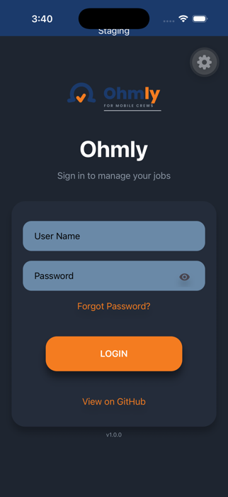
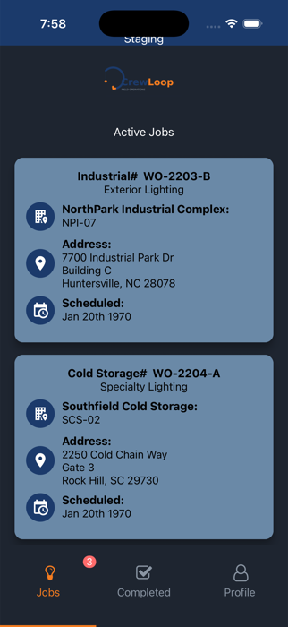
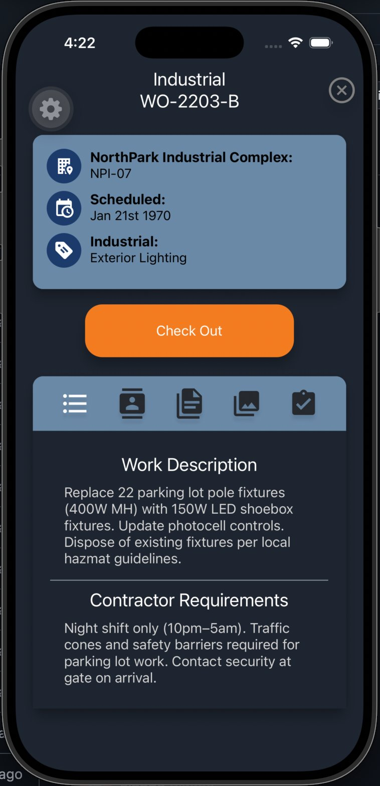
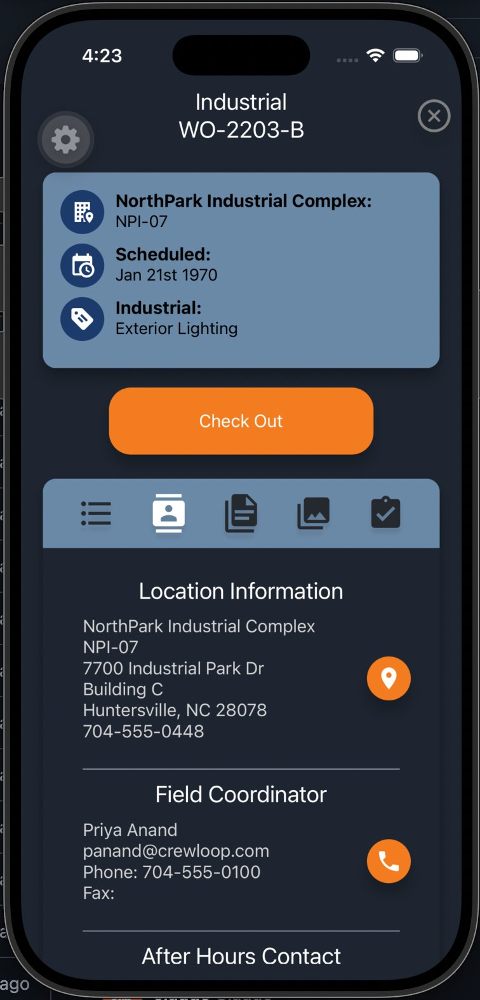
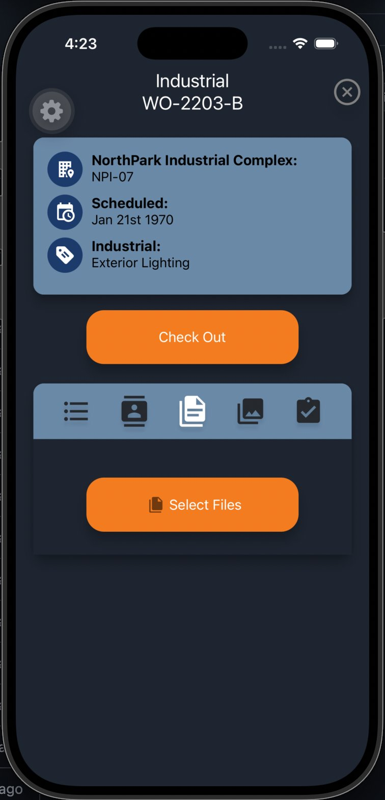
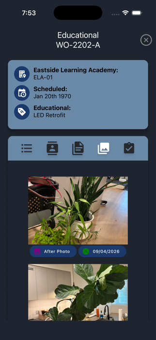
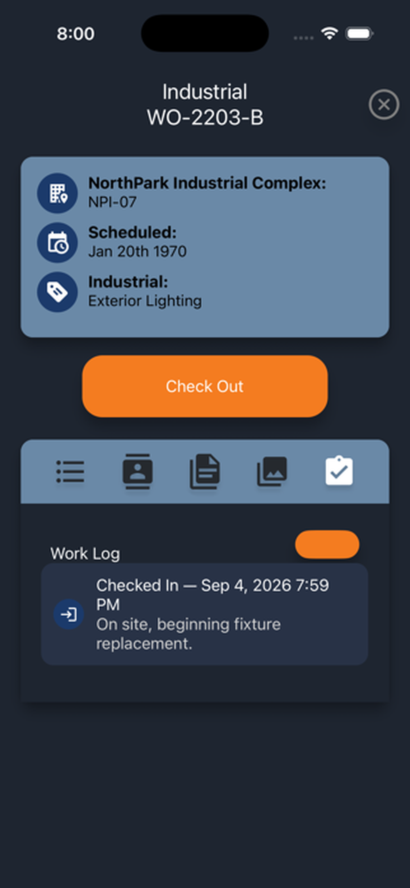
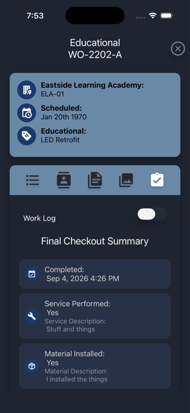
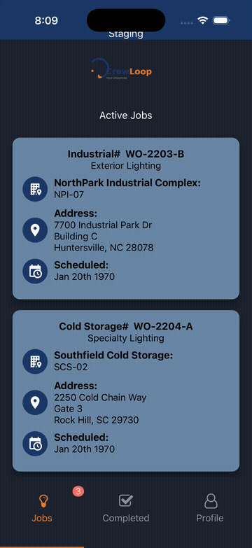
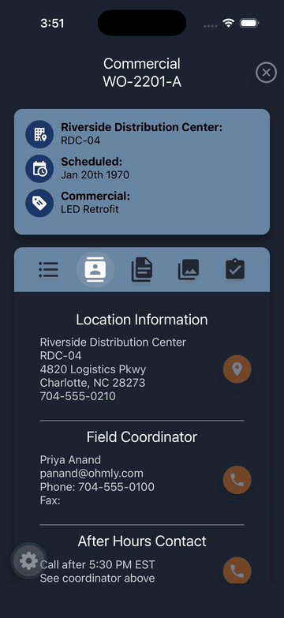

# CrewLoop

**Field operations management for mobile crews — built with React Native + Expo**

CrewLoop is a cross-platform iOS/Android field service app that connects subcontractors to a back-office CRM. Technicians use the app to manage their assigned jobs, document their work, and sync completed data back to the office — even when working in areas without internet connectivity.

> This repository is a portfolio demo. It uses a local mock API server with realistic sample data so you can run the full app without any account or backend dependency.

---
## Background

This app was originally built for production use at a field services company, where subcontractors use it daily to manage lighting retrofit jobs across warehouse, industrial, and commercial sites. The production version connects to a live CRM backend.

This demo version replaces the proprietary API with a local mock server and uses fictional company and job data. The core application code — including the offline-first SQLite architecture, job workflow, signature capture, and photo documentation — is identical to the production implementation.

---

## App Preview

### Login & Job Dashboard

<p align="center">
  
  &nbsp;&nbsp;
  
</p>

*Left: Login screen with environment indicator. Right: Active jobs dashboard showing assigned work orders with site address and scheduling info.*

---

### Job Details & Site Information

<p align="center">
  
  &nbsp;&nbsp;
  
</p>

*Left: Work description and contractor requirements for each job. Right: Location info with one-tap navigation and direct-dial field coordinator contact.*

---

### Documentation & Attachments

<p align="center">
  
  &nbsp;&nbsp;
  
</p>

*Left: Native document picker for attaching PDFs and files to a job record. Right: Photo documentation — select from library or capture directly with the camera.*

---

### Work Log & Final Checkout

<p align="center">
  
  &nbsp;&nbsp;
  
</p>

*Left: Work log showing check-in timestamp and comments recorded at the site. Right: Final checkout form — service performed, materials installed, walkthrough confirmation, and misc notes.*

---

### Workflow Demo

<p align="center">
  
  &nbsp;&nbsp;
  
</p>

*Full field technician workflow: login → job selection → check-in → documentation → checkout.*

---

## What the App Does

CrewLoop handles the full field technician workflow:

| Feature | Description |
|---|---|
| **Job Assignment List** | Technicians see all jobs assigned to them, pulled from the CRM |
| **Job Detail View** | Full job info — site address, work description, contractor requirements |
| **One-Tap Navigation** | Opens Apple Maps, Google Maps, or Waze directly to the job site |
| **One-Tap Calling** | Instant call buttons for the site contact and the office field coordinator |
| **Check-In / Check-Out** | Time tracking tied to each job with timestamp recording |
| **Photo Documentation** | Before/after photo capture and upload with labels |
| **Document Upload** | Attach PDFs and other documents to a job record |
| **Final Checkout** | Multi-step job completion form — tasks performed, materials installed, misc notes |
| **Manager Signature** | Digital signature capture from onsite manager at job completion |
| **Offline-First Architecture** | App continues to function without internet using SQLite local storage |
| **Manual Sync** | Pull-down to sync all offline records back to the CRM when connectivity returns |

---

## Technical Highlights

- **React Native + Expo** — cross-platform iOS and Android from a single codebase
- **SQLite (expo-sqlite)** — local database for offline-first data persistence
- **Offline sync queue** — records created offline are stored locally and batch-posted on reconnect
- **Axios** — API client with environment-based base URL configuration
- **Context API** — global job state shared across screens without prop drilling
- **Environment config** — production / staging / demo environments via `Config.js`
- **expo-image-picker** — native camera and photo library access
- **expo-document-picker** — native document selection
- **react-native-signature-canvas** — signature pad for manager sign-off
- **expo-linking** — deep linking into Maps apps and native phone dialer

---

## Running the Demo Locally

### Prerequisites

| Tool | Notes |
|---|---|
| **Node.js 18+** | [nodejs.org](https://nodejs.org) |
| **Expo Go** (physical device) | [iOS App Store](https://apps.apple.com/app/expo-go/id982107779) · [Google Play](https://play.google.com/store/apps/details?id=host.exp.exponent) |
| **Xcode** (iOS simulator, Mac only) | Install from the Mac App Store, then open it once to accept the license |
| **Android Studio** (Android emulator) | Install and create a virtual device via the AVD Manager |

---

### Step 1 — Clone the repo

```bash
git clone https://github.com/DanielGerrald/CrewLoop.git
cd CrewLoop
```

### Step 2 — Install dependencies

```bash
# App dependencies
npm install

# Mock API dependencies
cd mock-api && npm install && cd ..
```

### Step 3 — Start the mock API server

The mock API serves all the data the app needs — 5 realistic job records with contacts, addresses, and full job details.

```bash
npm run mock-api
```

You should see:

```
╔══════════════════════════════════════════╗
║       CrewLoop Mock API Server           ║
║       Running at http://localhost:3001   ║
╚══════════════════════════════════════════╝

Demo credentials:
  Username: demo
  Password: any value accepted
```

Keep this terminal open and running.

### Step 4 — Configure the API URL

> **Simulator / emulator:** `localhost` works out of the box — skip to Step 5.

> **Physical device:** Your phone can't reach your computer's `localhost`. You need to point the app at your machine's local network IP.

Find your IP address:

```bash
# macOS
ipconfig getifaddr en0

# Windows (look for "IPv4 Address" under your Wi-Fi adapter)
ipconfig

# Linux
hostname -I
```

Open `Config.js` and update the `apiUrl` in both the `development` and `default` cases:

```js
apiUrl: "http://YOUR_LOCAL_IP:3001",  // e.g. "http://192.168.1.42:3001"
```

Make sure your phone and computer are on the **same Wi-Fi network**.

### Step 5 — Start the Expo dev server

Open a new terminal in the project root:

```bash
npx expo start
```

Then choose how to run the app:

| Target | How |
|---|---|
| **iOS Simulator** | Press `i` in the terminal (Mac + Xcode required) |
| **Android Emulator** | Press `a` in the terminal (Android Studio AVD required) |
| **Physical device** | Scan the QR code with the **Expo Go** app |

### Step 6 — Log in

```
Username: demo
Password: (any value)
```

---

## Project Structure

```
CrewLoop/
├── App.js                  # Root component, navigation setup
├── Config.js               # Environment config (API URLs)
├── StyleSheet.js           # Global styles
├── app.config.js           # Expo config
│
├── Screens/                # Top-level screens
│   ├── Login.js
│   ├── Home.js
│   ├── JobsList.js
│   ├── CompletedJobs.js
│   └── Profile.js
│
├── Components/             # Reusable UI components
│   ├── JobCard.js
│   ├── AppSyncManager.js
│   ├── Context.js          # Global job state via Context API
│   ├── constants.js
│   └── JobDetails/         # Job detail sub-screens
│
├── Database/               # Data layer — SQLite + API calls
│   ├── SetupDatabase.js    # Schema creation and migrations
│   ├── UserDatabase.js     # Auth and user data
│   ├── CheckInOutDatabase.js
│   ├── AttachmentDatabase.js
│   ├── FinalCheckOutDatabase.js
│   ├── ContactDatabase.js
│   ├── WorkOrderDatabase.js
│   ├── LabelDatabase.js
│   └── UpdateGateApi.js    # App version check
│
├── assets/                 # Images, icons, splash screen, screenshots
│   ├── screenshots/        # App preview screenshots
│   ├── demo-workflow.gif   # Workflow demo GIF
│   └── demo-workflow-2.gif # Job detail demo GIF
│
└── mock-api/               # Local mock API server
    ├── server.js           # Express server with all endpoints
    └── package.json
```

---

## Mock API Endpoints

The mock server at `http://localhost:3001` provides:

| Method | Endpoint | Description |
|---|---|---|
| `GET` | `/version` | App version / update gate check |
| `POST` | `/login` | Authenticate and return user token |
| `GET` | `/userProfile` | Fetch logged-in user profile |
| `POST` | `/recoverPassword` | Send password reset |
| `GET` | `/workOrders` | All open work orders |
| `GET` | `/workOrderDetails?id=` | Contractor requirements and work description |
| `GET` | `/completedWorkOrders` | Completed work orders |
| `GET` | `/workOrderContacts?id=` | Site and coordinator contacts for a job |
| `GET` | `/workOrderCheckins?id=` | Check-in/out history for a job |
| `POST` | `/workOrderCheckin?id=` | Record a check-in or check-out |
| `POST` | `/uploadWorkOrderPhoto?id=` | Upload a photo attachment |
| `POST` | `/uploadWorkOrderDocument?id=` | Upload a document attachment |
| `POST` | `/updateWorkOrderCheckList?id=` | Submit final checkout checklist |
| `POST` | `/finalCheckout?id=` | Submit final checkout |
| `POST` | `/sync` | Batch sync offline records |
| `POST` | `/updateUserProfile` | Update user profile |

All data is in-memory. Restarting the server resets to the default sample dataset.

---


## What I'd Build Next

- **Push notifications** via Expo Notifications for new job assignments
- **Real-time job status** updates using WebSockets
- **Photo compression** before upload to reduce bandwidth usage
- **Biometric authentication** (Face ID / fingerprint) for faster login
- **Automatic background sync** when connectivity is restored, replacing the manual pull-down

---

## Tech Stack


---

*Built by Daniel Gerrald — [LinkedIn](https://www.linkedin.com/in/daniel-gerrald-493b89165) · [GitHub](https://github.com/DanielGerrald)*
